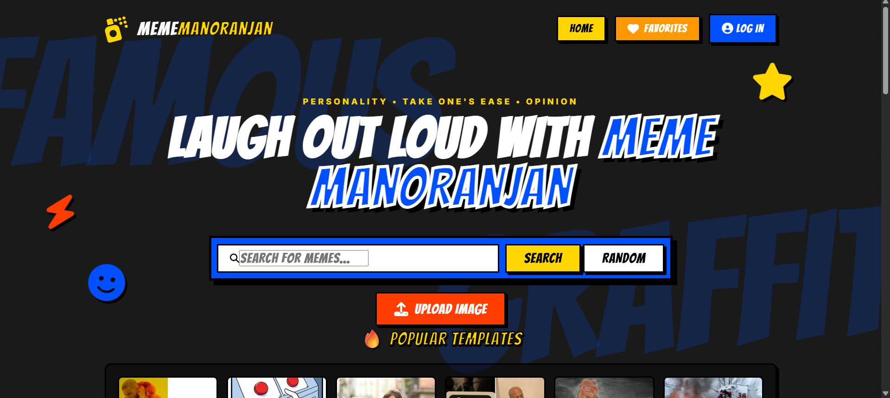
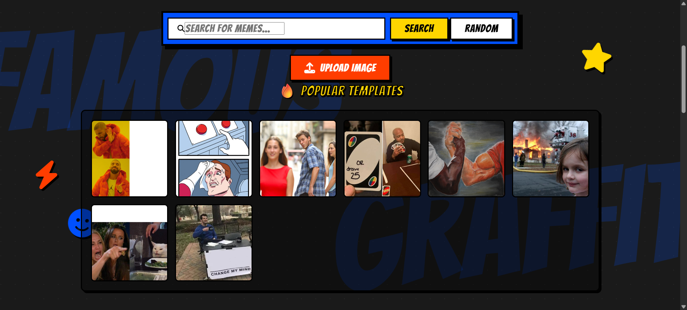
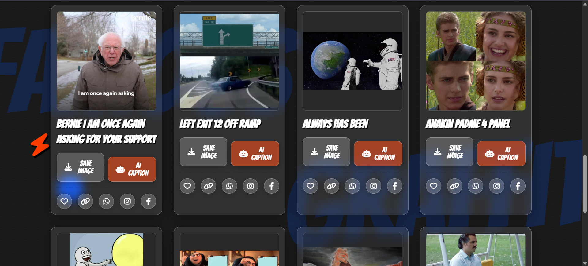
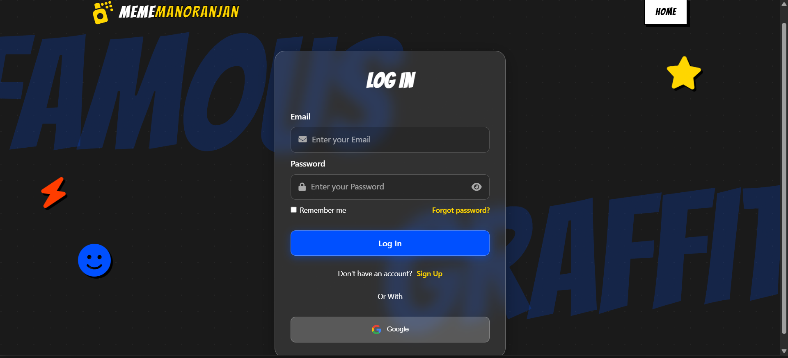
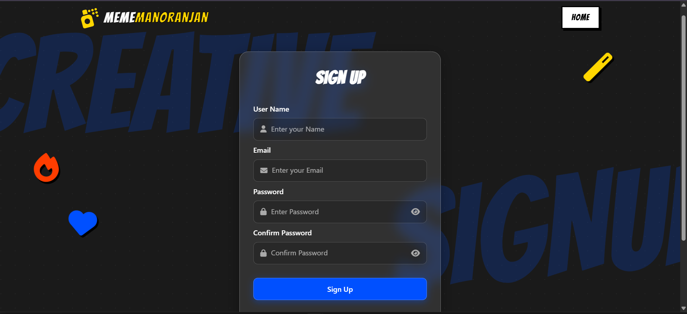
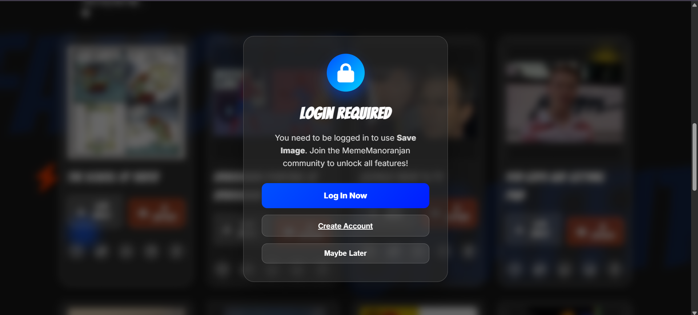
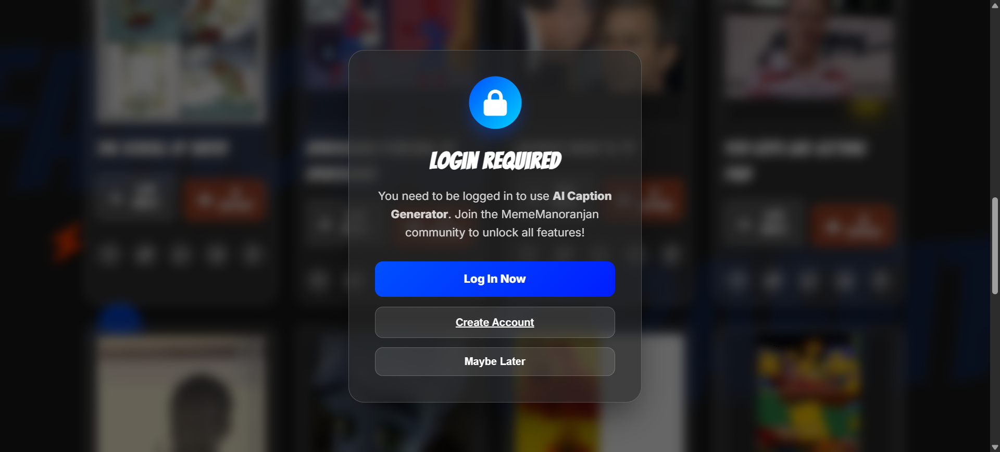

# 😉 MemeManoranjan

A full-stack meme generation and sharing platform with authentication, AI-powered captions, and a modern UI.

---

## ❄️Overview
MemeManoranjan is a web application that allows users to:

- Browse trending memes
- Generate custom memes
- Add AI-generated captions
- Save and share memes
- Authenticate using email/password or Google

Built using Flask (backend) and Netlify (frontend) with MongoDB Atlas for data storage.

---

## 🚀 Live Demo 
- 🔗 Frontend: https://mememanoranjan.netlify.app
- 🔗 Backend: https://mememanoranjan-backend.onrender.com

---

## 🛠️ Tech Stack
🔹 Frontend
- HTML, CSS, JavaScript
- Netlify (Deployment)
  
🔹 Backend
- Flask (Python)
- Gunicorn (Production server)
- Flask-CORS
  
🔹 Database
- MongoDB Atlas
  
🔹 Authentication
- JWT (JSON Web Tokens)
- Google OAuth
  
🔹 APIs
- Imgflip API (memes)
- Google Gemini API (AI captions)

---

## ✨ Features

🎭 Meme Features
- Browse trending memes
- Infinite scrolling
- Search memes
- Random meme generator

🤖 AI Features
- AI caption generation
- AI image title generation

🔐 Authentication
- Email & password login/signup
- Google login
- JWT-based session handling

❤️ User Features
- Save favorite memes
- Copy/share meme links
- Download edited memes

---

## 📁 Project Structure

    MemeManoranjan/
    │
    ├── backend/
    │   ├── app.py
    │   ├── routes/
    │   │   └── auth.py
    │   ├── models/
    │   └── requirements.txt
    │
    ├── frontend/
    │   ├── index.html
    │   ├── login.html
    │   ├── signup.html
    │   ├── script.js
    │   ├── style.css
    │
    └── README.md

---
# 📸 Screenshots & Features

### 🏠 Home Page

The landing page of MemeManoranjan where users can search memes, generate random memes, upload custom images, and access favorites or authentication features.

---

### 🔥 Popular Meme Templates

Browse trending and popular meme templates fetched from the meme API. Users can quickly select templates for meme creation.

---

### 🎭 Meme Gallery & Actions

The meme gallery displays available meme templates with options to save images, generate AI captions, add favorites, and share memes.

---

### 🔐 Login Page

Secure login page supporting email/password authentication and Google Sign-In.

---

### 📝 Signup Page

New users can create an account to access premium features such as AI caption generation and saved favorites.

---

### 🔒 Save Image Authentication Modal

Users attempting to save a meme without logging in are prompted to authenticate before accessing the feature.

---

### 🤖 AI Caption Authentication Modal

AI-powered caption generation is protected and requires user authentication to ensure secure API usage.

---

## 📝 Disclaimer

This project is created **only for learning and educational purposes**.  
It does **not** provide real streaming functionality or copyrighted content.  
All images/icons used are placeholders or royalty-free.

---

## 📩 Contributions

Contributions are always welcome!  
Feel free to fork, modify, and improve the UI.  
If you have ideas for better design or animations, send a Pull Request 😊

---

### ⭐ Don’t forget to give this project a star if you like it!

